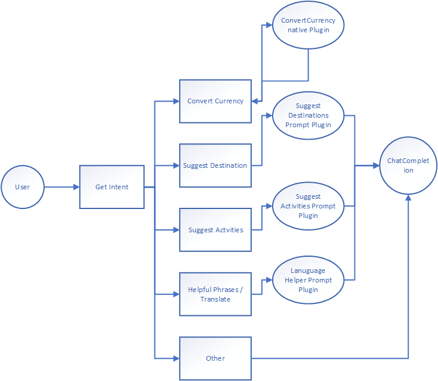

# AI Travel Agent 

## Prerequisites
    Semantic Kernel 

#### Pipeline




## Prerequisites

Adding secrets

```powershell
dotnet user-secrets set "AzureOpenAI:ApiKey" "<>" --id "aiapps" </item>
dotnet user-secrets set "AzureOpenAI:DeploymentChatName" "<>"--id "aiapps" </item>
dotnet user-secrets set "AzureOpenAI:Endpoint" "<>" --id "aiapps" </item>

```powershell
dotnet build
dotnet run
```

